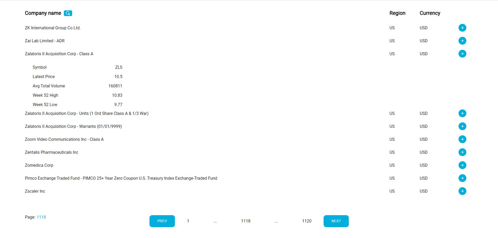
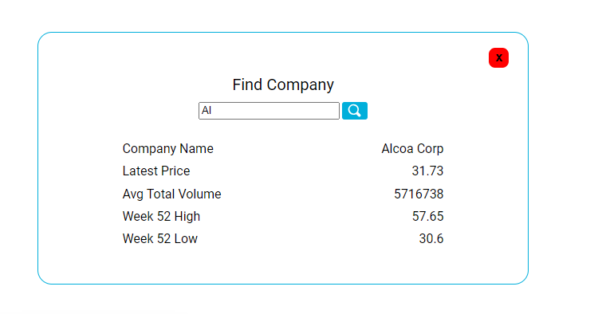

# Cybernetically Inc

Тестовое задание для компании Cybernetically Inc.

## Technology

1. React;
2. Redux;
3. Axios;
4. Redux Toolkit;
5. Redux-thunk;
6. HTML;
7. SASS;

## Description

Проект обладает функциональностью для просмотра информации по фин. инструментам. В этом задании, было создано React веб-приложение используя https://iexcloud.io/  API.

- ### Home page

<p align="center"></p>

На главной странице содержится информация предоставленная по API запросу, на странице не может содержаться более 10 отчетов, нажав на "+" можно увидеть более подробную информацию. 
Для поиска необходимой компании можно воспользоватся переходом по страницам (пагинация) или поиском компании по названию (значок лупы возле "Company name");

- ### Find Company

<p align="center"></p>

В данном окне по поиску, по части названия или полному, будет выдан первый подходящий результат. Будет выведена информация о компании. 

## Getting Started

Для запуска проекта необходимо: 

1. Клонировать репозиторий к себе (средствами git или архивом);
    ```
   git clone https://github.com/NikitaMih/cyberneticall.git
    ```
2. Установить взаимосвязи и необходимые библиотеки;
    ```
   npm i
    ```
3. Необходимо добавить токен (token) в файл variables.js;
4. Выполнить команду (после выполнения команды, на порту http://localhost:3000 развернется проект);
    ```
   npm run start
    ```  

##  Testing

- Для запуска тестов необходимо выполнить команду:
    ```
   npm run test
    ```  
